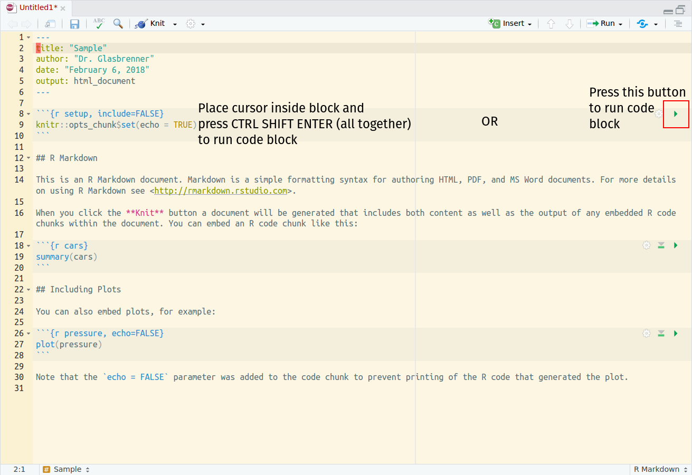

## Interactive RStudio

RStudio can be used to run code blocks interactively and display the results,
allowing you to preview what your knitted file will look like. You have two easy
methods available to you for running the code in a code block. The graphical way
is to click the green arrow located on the far-right side of a code block. The
keyboard shortcut is place your cursor *inside* the block and then press
<kbd>Ctrl</kbd>+<kbd>Shift</kbd>+<kbd>Enter</kbd> all together. The image below
illustrates:



Use one of these methods whenever you want to run the code within a block.

## Setup chunks

When you are given an RMarkdown template file, it will frequently have a
*setup* code block at the top of the page, much like the one below. These
chunks will configure the knitting procedure, which controls how your output
documents will look. Often, they will also load the libraries you will need to
complete an exercise or assignment. **If you reopen a file after restarting
RStudio or switching projects, you should always run this block first.**

Give it a try, run the block below.

```{r setup, eval = TRUE, results = FALSE, warning = FALSE, message = FALSE}
# DO NOT ALTER THIS CHUNK
knitr::opts_chunk$set(
  echo = TRUE,
  eval = TRUE,
  fig.width = 5,
  fig.asp = 0.618,
  out.width = "70%",
  dpi = 120,
  fig.align = "center",
  cache = FALSE
)
# Load required packages
suppressPackageStartupMessages(library(tidyverse))
```

If you didn't get an error, then excellent! If so, then you need to complete the
RStudio Server Initial Configuration first. If you need help, you can leave a
post on Slack.

## Demo: The `mpg` dataset

### Viewing the dataset

When loading `tidyverse`, several practice datasets are automatically loaded,
one of which is the `mpg` dataset. It's good practice to start by looking at
the dataset and getting familiar with the different columns and rows. You can
do this within RStudio, try running the code block below:

```{r mpg-table, eval = FALSE}
mpg
```

You can also read more about the dataset by running:

```r
?mpg
```

in the *Console* window.

#### Question

What is the data contained within the `mpg` dataset?

#### Answer

<!-- Write your answer below this line -->


### Make a scatterplot

It's very easy to make a scatterplot in R using the `ggplot2` library. This is
the library you will read about in Chapter 3 of *R for Data Science*. Let's use
it to plot each car's highway fuel efficiency (`hwy`) as a function of the
engine size (`displ`). The code block below will make this plot, try running
it!

```{r mpg-first-visual}
ggplot(data = mpg) +
  geom_point(mapping = aes(x = displ, y = hwy))
```

#### Question

Using your intuition, what part of the above code block tells R to put the
`displ` variable on the horizontal axis and the `hwy` variable on the vertical
axis?

#### Answer

<!-- Write your answer below this line -->


### Make a slight change

#### Exercise

Take a look at the `mpg` table again (in the section [Viewing the
dataset](#viewing-the-dataset)). Choose a **categorical variable** that isn't
`displ`. Then, change the visualization code below so that your chosen variable
replaces `displ` on the horizontal axis (the vertical should still be `hwy`).

#### Answer

<!-- Write the variable you chose below this line -->


<!-- Modify the code below in order to complete the exercise -->

```{r mpg-second-visual}
ggplot(data = mpg) +
  geom_point(mapping = aes(x = displ, y = hwy))
```

### Categories by color

The following code block extends the example with a new input, `color = class`.
Try running it below:

```{r mpg-add-color}
ggplot(data = mpg) +
  geom_point(mapping = aes(x = displ, y = hwy, color = class))
```

#### Question

What does adding `color = class` inside the `aes()` code section do?

#### Answer

<!-- Write your answer below -->

### Other variations

Try running these other variations as well and observing their outputs.

First, we move `color` outside of `aes()` and set it equal to the *string*
`"blue"`:

```{r mpg-color-outside-aes}
ggplot(data = mpg) +
  geom_point(mapping = aes(x = displ, y = hwy), color = "blue")
```

Here we replace `color` with `size`:

```{r mpg-add-size}
ggplot(data = mpg) +
  geom_point(mapping = aes(x = displ, y = hwy, size = class))
```

Here we replace `color` with `shape`:

```{r mpg-add-shape}
ggplot(data = mpg) +
  geom_point(mapping = aes(x = displ, y = hwy, shape = class))
```

#### Exercise

Create your own figure using the `mpg` dataset! Follow the patterns you see in
the above examples in order to build a new visualization. It should be
different from the examples you've done so far, but otherwise, it's up to you.

#### Answer

```{r mpg-custom-visual}
# Put your code inside this block
```

## End

When you are done, save the file and try knitting it to PDF to make sure that it
works. If you get an error message and it won't knit, then you will need to fix
something in one of the code blocks. If the PDF formatting rendering looks
funny, check through your RMarkdown file again and make sure you are following
the proper RMarkdown syntax rules. Consult the [RMarkdown
Cheatsheet](https://github.com/rstudio/cheatsheets/raw/master/rmarkdown-2.0.pdf)
and [RMarkdown
Reference](https://www.rstudio.com/wp-content/uploads/2015/03/rmarkdown-reference.pdf)
for help.
